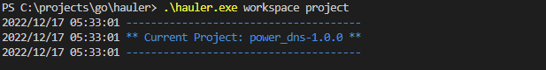

# Netbox

## Netbox

**This example installs Netbox an open source IP address management (IPAM) and data center infrastructure management (DCIM) tool developed specifically to address the needs of network and infrastructure engineers**

This demonstrates how you can use app profiles to adjust the install process  to achieve slightly different install goals. in this case you can install a blank Netbox or  Netbox with data.

<aside>
💡 Take what you have learnt from installing Power DNS and apply it here to install Netbox package.

</aside>

### Build Netbox package

You can pull the Netbox package from here 

[https://github.com/Mrpye/hauler-package-netbox](https://github.com/Mrpye/hauler-package-netbox)

The project is located under the main branch.

**Requirements**

You will need to have setup an public access token for GitHub and configured hauler see  ([Install Guide for more details](../Installation%20Guide.md))

<aside>
💡 Remember **-h** is you friend it will give you and example command and flags you can pass

</aside>

## **Switch Workspace**

When you have multiple workspaces you can switch between them using the following commands. When building a package you will automatically get switched to that workspace.

### Current workspace

```yaml
# See what work space you are in
.\hauler.exe workspace project
```



### List workspaces

```yaml
# List works spaces
.\hauler.exe workspace list
```


### Set workspace

```yaml
# Change Workspace by index
hauler workspace set project 3

# Change Workspace by name
hauler workspace set project "netbox-1.0.1"

# Change Workspace prompt
hauler workspace set project ?
```


## Build and Install Netbox

### Steps

Remember the 3 steps to installing a package 

- Build package
    
    Try build the package tar and add to repo
    
- If you added the package to the repo delete the Netbox workspace and try loading from the repo  (This is an optional step)

<aside>
💡 When deleting the workspace you will delete the current workspace you are in use the skills you learnt in Switch Workspace to make sure you are in the correct workspace before deleting

</aside>

```yaml
#Delete workspace
.\hauler.exe workspace delete -c yes

.\hauler.exe repo -h

Usage:
  hauler repo [command]

Available Commands:
  list        This list the available packages in the repo
  load        This command will load a package from the repo
```

- Answer File
- Run Install

### Try a Different profile

This package contains two profiles one will install a blank Netbox the other will install Netbox with data. user the package info command to see the name of the profile and update the answer and install command lines to reflect this.

### Summary

On top of the ability to build and install packages you have learn how to select different app profiles, Switch workspaces and delete workspace. Why not take a look at how the package is constructed  you can find package located in your workspace folder.